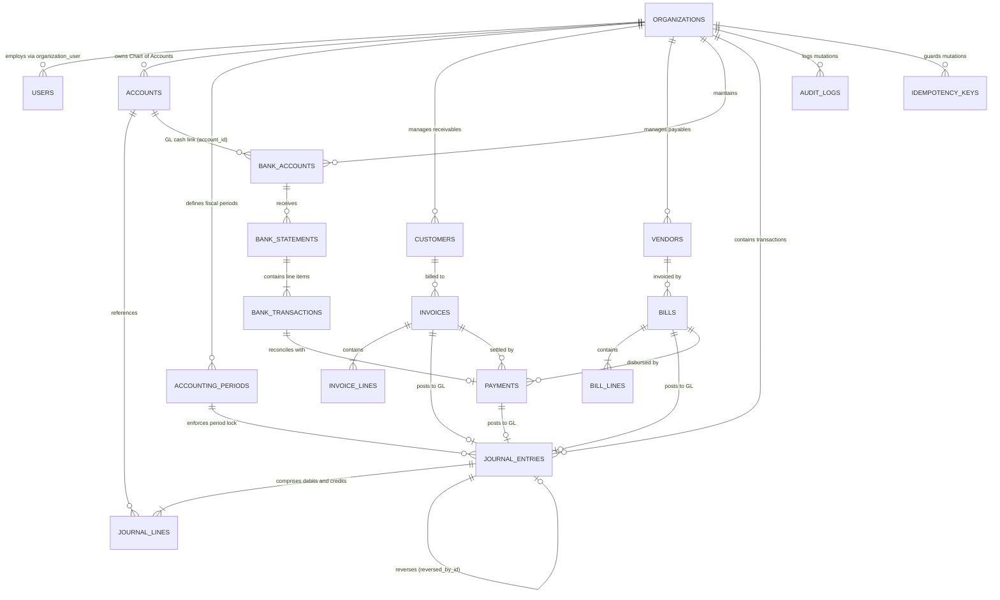

# Entity Relationship Diagram (ERD) & Database Architecture
**Version:** v0.3  
**Status:** Approved Architectural Model  
**Last Updated:** 2026-09-24  
**Author:** Lead Software Architect  

This document defines the complete relational schema, foreign key topology, tenant boundaries, indexes, and mathematical accounting invariants for the AI-Native Finance ERP core database.

---

## 1. Relational Topology Overview (Mermaid Diagram)

---

## 2. Core Table Schemas & Tenant Boundaries

### 2.1 Organizations & Identity
*All queries enforce `organization_id` tenant boundaries.*

#### `organizations`
Primary tenant entity.
* `id`: `UUID` (PK)
* `name`: `VARCHAR(255)` NOT NULL
* `legal_name`: `VARCHAR(255)` NOT NULL
* `base_currency`: `VARCHAR(3)` NOT NULL DEFAULT 'PKR'
* `fiscal_year_start_month`: `SMALLINT` NOT NULL DEFAULT 7 (July for Pakistan)
* `ntn`: `VARCHAR(30)` NULL (National Tax Number)
* `strn`: `VARCHAR(30)` NULL (Sales Tax Registration Number)
* `status`: `VARCHAR(20)` NOT NULL DEFAULT 'active' (`active`, `suspended`)
* `created_at`, `updated_at`: `TIMESTAMPTZ`

#### `users`
Global user identities with multi-organization membership.
* `id`: `UUID` (PK)
* `name`: `VARCHAR(255)` NOT NULL
* `email`: `VARCHAR(255)` NOT NULL UNIQUE
* `password`: `VARCHAR(255)` NOT NULL (Argon2id or bcrypt)
* `mfa_secret`: `VARCHAR(255)` NULL (Encrypted TOTP secret)
* `mfa_enabled`: `BOOLEAN` NOT NULL DEFAULT FALSE
* `created_at`, `updated_at`: `TIMESTAMPTZ`

#### `organization_user` (Pivot)
Tenant-specific membership and RBAC role assignment.
* `id`: `UUID` (PK)
* `organization_id`: `UUID` (FK -> `organizations.id`, ON DELETE CASCADE)
* `user_id`: `UUID` (FK -> `users.id`, ON DELETE CASCADE)
* `role`: `VARCHAR(50)` NOT NULL (`owner`, `admin`, `accountant`, `finance_manager`, `staff`, `auditor`)
* `is_default`: `BOOLEAN` NOT NULL DEFAULT FALSE
* `created_at`, `updated_at`: `TIMESTAMPTZ`
* **Unique Constraint:** `(organization_id, user_id)`

---

### 2.2 Chart of Accounts & Fiscal Periods

#### `accounts`
The ledger accounts governing double-entry tracking.
* `id`: `UUID` (PK)
* `organization_id`: `UUID` (FK -> `organizations.id`, ON DELETE CASCADE)
* `code`: `VARCHAR(20)` NOT NULL (e.g. `1010`, `1030`, `2010`, `4010`)
* `name`: `VARCHAR(255)` NOT NULL
* `classification`: `VARCHAR(20)` NOT NULL (`asset`, `liability`, `equity`, `revenue`, `expense`)
* `sub_type`: `VARCHAR(50)` NOT NULL (`cash_and_bank`, `receivable`, `payable`, `operating_expense`, etc.)
* `is_control_account`: `BOOLEAN` NOT NULL DEFAULT FALSE
* `control_type`: `VARCHAR(30)` NULL (`ar_control`, `ap_control`, `inventory_control`, `tax_control`)
* `is_active`: `BOOLEAN` NOT NULL DEFAULT TRUE
* `created_at`, `updated_at`: `TIMESTAMPTZ`
* **Unique Constraint:** `(organization_id, code)`

#### `accounting_periods`
Controls transaction posting dates and closing lifecycles.
* `id`: `UUID` (PK)
* `organization_id`: `UUID` (FK -> `organizations.id`, ON DELETE CASCADE)
* `fiscal_year`: `INT` NOT NULL (e.g. 2025)
* `period_number`: `SMALLINT` NOT NULL (1 to 12)
* `name`: `VARCHAR(50)` NOT NULL (e.g. "July 2025")
* `start_date`: `DATE` NOT NULL
* `end_date`: `DATE` NOT NULL
* `status`: `VARCHAR(20)` NOT NULL DEFAULT 'open' (`open`, `soft_closed`, `hard_closed`)
* `closed_at`: `TIMESTAMPTZ` NULL
* `closed_by`: `UUID` NULL (FK -> `users.id`)
* **Unique Constraint:** `(organization_id, start_date, end_date)`

---

### 2.3 General Ledger & Journals

#### `journal_entries`
Header for posted double-entry journal transactions. Immutable once posted.
* `id`: `UUID` (PK)
* `organization_id`: `UUID` (FK -> `organizations.id`, ON DELETE CASCADE)
* `accounting_period_id`: `UUID` (FK -> `accounting_periods.id`)
* `entry_number`: `VARCHAR(50)` NOT NULL
* `entry_date`: `DATE` NOT NULL
* `status`: `VARCHAR(20)` NOT NULL DEFAULT 'draft' (`draft`, `posted`, `reversed`)
* `source_type`: `VARCHAR(50)` NOT NULL (`manual`, `sales_invoice`, `vendor_bill`, `payment`, `revenue_recognition`)
* `source_id`: `UUID` NULL
* `description`: `TEXT` NOT NULL
* `currency`: `VARCHAR(3)` NOT NULL DEFAULT 'PKR'
* `total_amount`: `NUMERIC(18, 4)` NOT NULL
* `reversed_by_id`: `UUID` NULL (Self-FK -> `journal_entries.id`)
* `posted_at`: `TIMESTAMPTZ` NULL
* `posted_by`: `UUID` NULL (FK -> `users.id`)
* `created_at`, `updated_at`: `TIMESTAMPTZ`
* **Unique Constraint:** `(organization_id, entry_number)`

#### `journal_lines`
Individual debit and credit line items.
* `id`: `UUID` (PK)
* `organization_id`: `UUID` (FK -> `organizations.id`, ON DELETE CASCADE)
* `journal_entry_id`: `UUID` (FK -> `journal_entries.id`, ON DELETE CASCADE)
* `account_id`: `UUID` (FK -> `accounts.id`)
* `line_number`: `INT` NOT NULL
* `debit`: `NUMERIC(18, 4)` NOT NULL DEFAULT 0.0000
* `credit`: `NUMERIC(18, 4)` NOT NULL DEFAULT 0.0000
* `description`: `VARCHAR(500)` NULL
* `created_at`, `updated_at`: `TIMESTAMPTZ`
* **Check Constraints (Mandatory Safeguards):**
  1. `CHECK (debit >= 0 AND credit >= 0)` (No negative values)
  2. `CHECK ((debit > 0 AND credit = 0) OR (credit > 0 AND debit = 0))` (Mutually exclusive line values)

---

### 2.4 Subledgers: Sales, Purchasing & Payments

#### `customers`
* `id`: `UUID` (PK)
* `organization_id`: `UUID` (FK -> `organizations.id`, ON DELETE CASCADE)
* `name`: `VARCHAR(255)` NOT NULL
* `email`: `VARCHAR(255)` NULL
* `tax_number`: `VARCHAR(30)` NULL (NTN / STRN)
* `currency`: `VARCHAR(3)` NOT NULL DEFAULT 'PKR'
* `payment_terms_days`: `INT` NOT NULL DEFAULT 30

#### `invoices`
Sales Invoices (Accounts Receivable).
* `id`: `UUID` (PK)
* `organization_id`: `UUID` (FK -> `organizations.id`, ON DELETE CASCADE)
* `customer_id`: `UUID` (FK -> `customers.id`)
* `journal_entry_id`: `UUID` NULL (FK -> `journal_entries.id`)
* `invoice_number`: `VARCHAR(50)` NOT NULL
* `issue_date`: `DATE` NOT NULL
* `due_date`: `DATE` NOT NULL
* `status`: `VARCHAR(20)` NOT NULL DEFAULT 'draft' (`draft`, `posted`, `partially_paid`, `paid`, `void`)
* `subtotal`: `NUMERIC(18, 4)` NOT NULL
* `tax_amount`: `NUMERIC(18, 4)` NOT NULL DEFAULT 0.0000
* `total_amount`: `NUMERIC(18, 4)` NOT NULL
* `amount_paid`: `NUMERIC(18, 4)` NOT NULL DEFAULT 0.0000
* `fbr_invoice_number`: `VARCHAR(100)` NULL
* `fbr_qr_code`: `TEXT` NULL
* `fbr_status`: `VARCHAR(30)` NOT NULL DEFAULT 'pending' (`pending`, `fiscalized`, `failed`)

#### `vendors`
* `id`: `UUID` (PK)
* `organization_id`: `UUID` (FK -> `organizations.id`, ON DELETE CASCADE)
* `name`: `VARCHAR(255)` NOT NULL
* `tax_number`: `VARCHAR(30)` NULL
* `wht_rate`: `NUMERIC(5, 2)` NOT NULL DEFAULT 0.00 (Standard Section 153 WHT rate)

#### `bills`
Vendor Bills (Accounts Payable).
* `id`: `UUID` (PK)
* `organization_id`: `UUID` (FK -> `organizations.id`, ON DELETE CASCADE)
* `vendor_id`: `UUID` (FK -> `vendors.id`)
* `journal_entry_id`: `UUID` NULL (FK -> `journal_entries.id`)
* `bill_number`: `VARCHAR(50)` NOT NULL
* `issue_date`: `DATE` NOT NULL
* `due_date`: `DATE` NOT NULL
* `status`: `VARCHAR(20)` NOT NULL DEFAULT 'draft' (`draft`, `pending_approval`, `posted`, `paid`, `void`)
* `subtotal`: `NUMERIC(18, 4)` NOT NULL
* `tax_amount`: `NUMERIC(18, 4)` NOT NULL DEFAULT 0.0000
* `total_amount`: `NUMERIC(18, 4)` NOT NULL
* `amount_paid`: `NUMERIC(18, 4)` NOT NULL DEFAULT 0.0000

#### `payments`
Cash disbursements and collections.
* `id`: `UUID` (PK)
* `organization_id`: `UUID` (FK -> `organizations.id`, ON DELETE CASCADE)
* `bank_account_id`: `UUID` (FK -> `bank_accounts.id`)
* `journal_entry_id`: `UUID` NULL (FK -> `journal_entries.id`)
* `payment_type`: `VARCHAR(20)` NOT NULL (`customer_receipt`, `vendor_disbursement`)
* `payable_type`: `VARCHAR(50)` NULL (`invoices`, `bills`)
* `payable_id`: `UUID` NULL
* `payment_date`: `DATE` NOT NULL
* `amount`: `NUMERIC(18, 4)` NOT NULL
* `withholding_tax_amount`: `NUMERIC(18, 4)` NOT NULL DEFAULT 0.0000 (WHT Section 153)
* `net_amount`: `NUMERIC(18, 4)` NOT NULL (Amount debited/credited from bank)
* `reference`: `VARCHAR(100)` NULL

---

### 2.5 Banking & Reconciliation

#### `bank_accounts`
Corporate accounts linked to the GL.
* `id`: `UUID` (PK)
* `organization_id`: `UUID` (FK -> `organizations.id`, ON DELETE CASCADE)
* `account_id`: `UUID` (FK -> `accounts.id`) (Mandatory GL link)
* `account_title`: `VARCHAR(255)` NOT NULL
* `bank_name`: `VARCHAR(100)` NOT NULL
* `branch_code`: `VARCHAR(50)` NULL
* `account_number`: `VARCHAR(50)` NOT NULL
* `iban`: `VARCHAR(34)` NULL
* `currency`: `VARCHAR(3)` NOT NULL DEFAULT 'PKR'
* `current_balance`: `NUMERIC(18, 4)` NOT NULL DEFAULT 0.0000
* `is_active`: `BOOLEAN` NOT NULL DEFAULT TRUE

#### `bank_transactions`
Imported statement lines.
* `id`: `UUID` (PK)
* `organization_id`: `UUID` (FK -> `organizations.id`, ON DELETE CASCADE)
* `bank_account_id`: `UUID` (FK -> `bank_accounts.id`, ON DELETE CASCADE)
* `transaction_date`: `DATE` NOT NULL
* `amount`: `NUMERIC(18, 4)` NOT NULL (Positive for deposit, negative for withdrawal)
* `description`: `TEXT` NOT NULL
* `reference_number`: `VARCHAR(100)` NULL
* `fingerprint`: `VARCHAR(64)` NOT NULL (SHA-256 for deduplication)
* `is_reconciled`: `BOOLEAN` NOT NULL DEFAULT FALSE
* `matched_payment_id`: `UUID` NULL (FK -> `payments.id`)
* **Unique Constraint:** `(organization_id, fingerprint)`

---

### 2.6 Audit, Idempotency & Security

#### `audit_logs`
Append-only log of every financial state mutation.
* `id`: `UUID` (PK)
* `organization_id`: `UUID` (FK -> `organizations.id`, ON DELETE CASCADE)
* `user_id`: `UUID` NULL (FK -> `users.id`)
* `action`: `VARCHAR(100)` NOT NULL (e.g. `journal:posted`, `invoice:fiscalized`, `period:soft_closed`)
* `auditable_type`: `VARCHAR(100)` NOT NULL
* `auditable_id`: `UUID` NOT NULL
* `old_values`: `JSONB` NULL
* `new_values`: `JSONB` NULL
* `ip_address`: `VARCHAR(45)` NULL
* `created_at`: `TIMESTAMPTZ` NOT NULL DEFAULT CURRENT_TIMESTAMP

#### `idempotency_keys`
Prevents accidental double-posting from client retries or network replays.
* `id`: `UUID` (PK)
* `organization_id`: `UUID` (FK -> `organizations.id`, ON DELETE CASCADE)
* `key`: `VARCHAR(255)` NOT NULL
* `route`: `VARCHAR(255)` NOT NULL
* `request_hash`: `VARCHAR(64)` NOT NULL
* `response_status`: `INT` NOT NULL
* `response_body`: `JSONB` NOT NULL
* `created_at`: `TIMESTAMPTZ` NOT NULL DEFAULT CURRENT_TIMESTAMP
* **Unique Constraint:** `(organization_id, key)`

---

## 3. Mandatory Accounting Safeguards (Engine Invariants)

The database schema and posting engine strictly enforce the following ten invariants:

1. **Non-Negative Debit & Credit Invariant:**
   * SQL Check: `CHECK (debit >= 0 AND credit >= 0)`. Negative debits and negative credits are strictly forbidden.
2. **Mutually Exclusive Line Invariant:**
   * SQL Check: `CHECK ((debit > 0 AND credit = 0) OR (credit > 0 AND debit = 0))`. A journal line cannot have both debit and credit amounts.
3. **Balanced Journal Invariant:**
   * Engine Assertion: For any entry transitioning to `status = 'posted'`, `SUM(debit) == SUM(credit)`. Transactions with rounding differences of even 0.0001 PKR reject posting.
4. **Immutability of Posted Records:**
   * Database Trigger & Policy: Once `status = 'posted'`, UPDATE and DELETE operations on `journal_entries` and `journal_lines` are rejected. Corrections require an explicit reverse entry (`source_type = 'reversal'`).
5. **Control Account Protection:**
   * Engine Guard: Direct manual journal drafts (`source_type = 'manual'`) targeting accounts where `is_control_account = TRUE` (Accounts Receivable `1030`, Accounts Payable `2010`, Inventory `1050`) are rejected with an authorization exception. Control accounts can only be mutated through subledger documents.
6. **Soft-Close Operational Restriction:**
   * Engine Guard: If an accounting period is `soft_closed`, no operational transactions (Invoices, Bills, Customer Receipts, Vendor Disbursements) can be posted to that period. Only adjusting journal entries by Authorized Accountants are permitted.
7. **Hard-Close Audit Lock:**
   * Engine Guard: If an accounting period is `hard_closed`, all posting is rejected without exception. Reopening requires CFO/Owner credentials with step-up MFA and audit justification.
8. **Posting Idempotency:**
   * Request Guard: Every mutating financial request requires an `Idempotency-Key` header. Duplicate attempts return the cached response without creating duplicate GL lines.
9. **Mandatory Audit Lineage:**
   * Engine Hook: Every mutation writes before/after state snapshots to `audit_logs` in the same database transaction.
10. **Strict Tenant Context Isolation:**
    * Multi-Tenancy Guard: Every query automatically includes `organization_id = :current_tenant_id` via framework global scopes, reinforced by compound unique constraints.

---

## 4. Security & AI Operational Boundaries

1. **Short-Lived Access Tokens:**
   * API tokens have a maximum lifetime of 60 minutes. Clients refresh tokens using secure HTTP-only cookie refresh credentials.
2. **Step-Up MFA for High-Risk Actions:**
   * Modifying bank accounts, reopening hard-closed periods, or posting manual reversals exceeding 1,000,000 PKR requires a valid TOTP code in the request header (`X-MFA-Code`).
3. **Untrusted OCR & Document Isolation:**
   * Document OCR output is treated strictly as untrusted data strings.
   * OCR output is parsed into strongly typed JSON structures (Pydantic / Zod) before being referenced by any business service.
4. **Strict Prompt-Injection Defenses:**
   * Raw text from uploaded vendor invoices is never injected directly into LLM system prompts. It is bounded in JSON data blocks.
5. **No Code Execution Privileges for AI:**
   * The AI microservice has zero database write access and zero server-side code execution privileges.
6. **Mandatory Human-in-the-Loop for Financial Posting:**
   * AI can produce transaction classification suggestions and draft journal entries (`status = 'draft'`).
   * The transition from `draft` to `posted` strictly requires explicit human approval by a user with `accountant` or `finance_manager` permissions.
